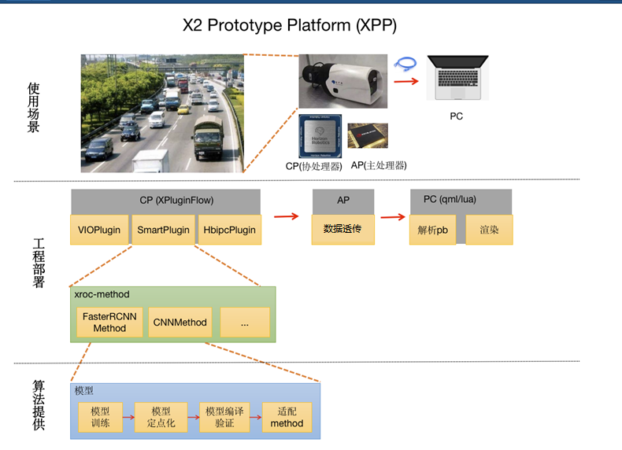

<!-- TOC -->

- [综述](#综述)
    - [总体架构](#总体架构)
            - [XPP（X2 prototype platform）:](#xppx2-prototype-platform)
            - [XRoc-framework](#xroc-framework)
- [工程组织](#工程组织)
    - [目录结构](#目录结构)
    - [external](#external)
            - [预编译库](#预编译库)
    - [开源库](#开源库)
- [构建Solution](#构建solution)
- [BUILD](#build)
    - [开源repo的编译方式](#开源repo的编译方式)
    - [基础库重新编译之后，依赖于该基础库的repo也要重新编译](#基础库重新编译之后依赖于该基础库的repo也要重新编译)
- [Deploy](#deploy)

<!-- /TOC -->
# 综述
该repo可用于构建基于地平线BPU的solution方案。
##  总体架构
#### XPP（X2 prototype platform）:
即X2原型开发平台，目标是通过解耦智能化与非智能化模块， 并将相对稳定的非智能化模块（输入vio、输出hbipc、展示端等）沉淀为一系列标准组件、工具等，使得算法或者算法策略同学只需专注于算法模块开发，就可以快速完成AI应用的部署验证。原型平台选择了96board作为基础开发调试平台，但同时支持96board开发完成的智能化应用可以快速迁移至其他基于X2 BPU的终端设备中。   
***该repo为XPP CP侧工程，不包含展示端等AP侧应用*** 
> CP: Co-Processor, 包含AI加速芯片BPU等;  
> AP: Application Processor, 应用处理器，主要用于视频编解码、图像处理等。  
#### XRoc-framework
一种基于数据流的SDK编程框架：  
1）可以通过JSON配置构建workflow，workflow是一个有向拓扑图，图中每个节点（Node）管理了一个或多个同类型method的实例；  
2）method表示一种能力，通常是某类模型能力（人脸检测、人脸Pose等）或者算法策略（过滤策略、融合策略、优选策略等）;   
3）workflow表示一个范式，定义了一组能力的串联方式，比如人脸检测、跟踪、属性（pose、blur等）以及优选等能力级联起来可以构建一个人脸抓拍范式；   
4）XRoc-Framework定义了一套面向workflow的通用sdk C++接口，通过设置不同的配置文件同一套接口可以运行不同的workflow。

下图是在ipc平台，从算法训练到部署环节XPP与XRoc的位置：  

- 这张图以XPP IPC的架构为例， 96board架构类似， 只是把展示端也集成到AP侧， 96board直接接显示器即可完成展示。
- 目前XPP划分的基本模块：VIOPlugin（X2视频输入基本模块）、SmartPlugin（智能业务基本模块）、HbipcPlugin（X2 bif基础模块，负责CP-AP侧通信）、template AP（最简AP，只做数据透传）、展示端；
- 为了适配不同的智能化应用及智能化应用的跨平台迁移，XPP将输入（VIO）、智能化模块、输出（hbipc）等抽象为独立的插件（plugin），并定义了插件之间的标准通信接口，再通过消息总线完成不同插件之间的数据交互；基于上述架构，通过抽象vioplugin、smartplugin、hbipcplugin通用接口，对不同的平台（96board 或者X2 IPC）需要做的只是适配vioplugin与hbipcplugin，smartplugin可以自由在不同X2 平台迁移。
- 输入（VIOPlugin）、输出（HbipcPlugin）模块由嵌入式同学实现，并已沉淀为基础组件，对算法或者算法策略开发同学通常只需要关注于智能化模块的开发（SmartPlugin）。
- SmartPlugin目前默认实现是基于XRoc-framework面向workflow的通用接口实现了单workflow的AI应用运行框架；XROC framework是组织业务workflow的运行框架，同时该框架提供了基于配置串联workflow的能力，以及由workflow构建算法sdk的通用接口等；XRoc workflow由一系列method组成，每个method都表示一个算法能力或策略；
- 前端也做了模块化抽象，开发者通常只需要完成pb解析，类似于openCV完成基本图元（框、点、线、文字等等）的渲染就行。

# 工程组织
## 目录结构
```
.
├── cnnmethod
│   ├── deps -> ../external/
│   ├── example
│   ├── include
│   ├── model
│   ├── src
│   └── test
├── doc
│   └── images
├── external
│   ├── bpu_predict
│   ├── CNNMethod
│   ├── FaceSnapFilterMethod
│   ├── FasterRCNNMethod
│   ├── GradingMethod
│   ├── gtest
│   ├── hbipc
│   ├── hbipcplugin
│   ├── hobotlog
│   ├── hobotsdk
│   ├── ipc_tracking
│   ├── jsoncpp
│   ├── libjpeg-turbo
│   ├── libyuv
│   ├── MOTMethod
│   ├── opencv
│   ├── protobuf
│   ├── SnapShotMethod
│   ├── vioplugin
│   ├── vision_type
│   ├── x2_prebuilt
│   ├── xpluginflow
│   ├── xpluginflow_msgtype
│   ├── xroc-framework
│   └── xroc-imagetools
├── facesnapfiltermethod
│   ├── cmake
│   ├── config
│   ├── deps -> ../external/
│   ├── include
│   ├── src
│   └── test
├── fasterrcnnmethod
│   ├── configs
│   ├── deps -> ../external/
│   ├── example
│   ├── include
│   ├── output
│   ├── src
│   └── test
├── GradingMethod
│   ├── config
│   ├── deps -> ../external/
│   ├── include
│   ├── src
│   └── test
├── hbipcplugin
│   ├── cicd
│   ├── cmake
│   ├── config
│   ├── deps -> ../external/
│   ├── gradle
│   ├── include
│   ├── output
│   ├── sample
│   ├── scm
│   ├── scripts
│   ├── src
│   └── test
├── smartplugin
│   ├── deploy
│   ├── deps -> ../external/
│   ├── docs
│   ├── include
│   ├── models
│   ├── sample
│   ├── src
│   └── test
├── SnapshotMethod
│   ├── config
│   ├── deps -> ../external/
│   ├── include
│   ├── src
│   └── test
├── vioplugin
│   ├── configs
│   ├── deps -> ../external/
│   ├── include
│   ├── src
│   └── test
├── xpluginflow
│   ├── deps -> ../external/
│   ├── doc
│   ├── include
│   ├── sample
│   ├── src
│   └── test
├── xpluginflow_msgtype
│   ├── deps -> ../external/
│   ├── doc
│   ├── include
│   ├── src
│   └── test
└── xroc-framework
    ├── config
    ├── deps -> ../external/
    ├── doc
    ├── example
    ├── include
    ├── src
    ├── test
    ├── tools
    └── tutorials
```
## external
依赖库安装目录，主要有两种来源：  
1）预编译的库，相关源码暂未开源或公共第三方库， 比如 bpu_predict、hbipc、libyuv、opencv等;  
2）本地编译的库，相关源码开源给客户，如Smartplugin、FasterrcnnMethod、CNNMethod等;  

#### 预编译库
* jsoncpp：第三方开源库，用于json解析;
* libjpeg-turbo：第三方开源库，用于jpeg格式图像处理;
* libyuv：第三方开源库，用于yuv格式图像处理;
* opencv： 第三方开源库，主要用于计算机视觉处理;
* protobuf： 第三方开源库，多平台或者多模块间消息交互协议;
* gtest：第三方开源库，google test框架;
* hobotlog：地平线提供的日志系统，支持不同的优先级控制等特性;
* x2_prebuilt： x2平台底层系统库或者hbdk基础库等;
* bpu_predict：地平线bpu预测库;
* hbipc: CP-AP传输基础库;
* xpluginflow: 消息订阅与分发的编程框架，每个基础组件以插件（plugin）的形式管理;
* xpluginflow_msgtype：定义了XPP基础消息类型;
* vioplugin： 基于xpluginflow封装的用于vio管理的插件;
* hbipcplugin：基于xpluginflow封装的用于AP-CP通信的插件;
* xroc-framework： 一套基于数据流的编程框架;
* hobotsdk：另一种基于数据流的编程框架;
* ipc_tracking:基于IOU的多目标跟踪（MOT）策略库;
* MOTMethod：基于XRoc-framework封装的多目标跟踪（MOT）方法模块;
* vision_type： 提供了视觉业务需要常见数据结构定义，如bbox、landmark等;
* xroc-imagetools：对常用图像处理的封装;

## 开源库
* fasterrcnnMethod: 基于地平线bpu的Fasterrcnn模型处理模块;
* CNNMethod: 基于地平线bpu常用cnn模型处理模块;
* facesnapfiltermethod: 人脸过滤策略模块;
* GradingMethod: 人脸综合打分模块，作为优选模块（Snapshotmethod）输入，是优选过程的重要参考;
* Snapshotmethod: 人脸优选模块。
* SmartPlugin: 基于xpluginflow的智能处理插件，监听vioplugin输出信息;默认实现是基于XRoc-framework面向workflow的通用接口实现了单workflow的AI应用运行框架;  
***基于该工程构建solution的入口在smartplugin，main函数在smartplugin/sample/smart_main.cpp***

# 构建Solution
1. **适配vio**  
* 不同的终端设备可能会有不同的输入接口(mipi、bt1120)、不同的cam配置（单目、双目），以及不同的应用场景（实时视频流或者回灌模式）等，因此在构建solution之前需要先视频vio配置;   
* vio配置参数详解见[vioplugin](./vioplugin/README.md);   
* 如果当前vioplugin不能满足终端需求，请及时联系地平线人员提供支持。
2. **基于XRoc-framework集成模型、开发算法策略模块等**  
* XRoc-framework提供了面向数据流的编程框架，基于该框架可以将多个业务模块串联起来构建一个workflow，模型集成或者算法策略模块以method的形式加入workflow中。[tutorials](xroc-framework/tutorials/README.md)  
* XRoc的开发指南见XRoc-framwork/tutorials;
* 该repo预提供了几个method（fasterrcnnmethod, cnnmethod, Snapfiltermethod, Gradingmethod，Snapshotmethod等）， 基于这些method可以构建人脸抓拍识别workflow;  
* Fasterrcnnmethod、CNNMethod对模型集成做了部分抽象，建议用户基于此完成自己的模型适配或者集成新的模型;
3. **基于SmartPlugin构建Solution**
* Smartplugin为该工程构建solution的入口，保护main程序（smartplugin/sample/smart_main.cpp）;
* 默认实现是基于XRoc-framework面向workflow的通用接口实现了单workflow的AI应用运行框架;大部分情况下，用户可基于该实现通过简单修改完成自己的solution构建，构建过程详细参考[smartplugin](./smartplugin/README.md);
* 如果默认构建不满足需求，用户还可以自定义plugin实现，自定义plugin的方式详见[xpluginflow](./xpluginflow/sample/sample_plugin.cpp);

# BUILD
## 开源repo的编译方式
> mkdir build & cd build  
> cmake ..  
> make  
> make install   

最终会install到 external对应目录。
## 基础库重新编译之后，依赖于该基础库的repo也要重新编译
比如
* 如果xroc-framework重新编译， 所有method（如Fasterrcnnmethod、cnnmethod、GradingMethod等等）、SmartPlugin都需要重新编译一下;
* 如果xpluginflow、或者xpluginflow_msgtype重新编译，所有plugin(vioplugin、smartplugin、hbipcplugin等)都需要重新编译。

# Deploy
部署包为smartplugin/deploy/下的xppcp_smart，完成vio适配后，将其copy到设备上运行`sh xpp_start.sh`就可以执行。

