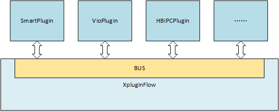

# XPluginFlow 接口文档
XPluginFlow为一个插件管理和消息订阅分发框架. 它将插件共有的特性抽象成一个标准基类,使用XPluginFlow的插件必须继承于该基类.  
基于XPluginFlow的Plugin是通过消息驱动的, 所有的Plugin都挂载到XPluginFlow的内部消息总线中,当一个插件产生消息并把消息Push到总线之后,其他订阅该消息的插件回调函数就会被调用.每一个Plugin都可以向总线订阅和发布消息.  
XPluginFlow与Plugin之间的关系如下图:  

**接口详细用法参考`sample_plugin.cpp`**

## 声明消息类型
每一类消息都有一个字符串形式的消息类型和结构体来表示.
### 定义
#include "xpluginflow/message/pluginflow/msg_registry.h"

**XPLUGIN_REGISTER_MSG_TYPE(*MSG_TYPE*)**
### 参数
+ MSGTYPE: 消息类型
### 说明
该接口为一个宏, 参数*MSG_TYPE*用来表示声明的消息类型, 需要直接使用标识符的格式书写, 宏内部会将其转成字符串.  
**注意**: 需要在消费者Plugin调用订阅消息接口之前调用该接口声明消息类型,一般将该宏放在全局变量声明的位置.  

## 初始化Plugin
### 定义
#include "xpluginflow/plugin/xpluginasync.h"

**int XPluginAsync::Init() override;**

### 参数
无

### 返回值
+ 0: 成功
+ 非0: 失败

### 说明
该接口需要继承`XPluginAsync`类的自定义Plugin实现该接口定义. 该接口用来初始化Plugin.  
自定义Plugin一般在该接口内调用*订阅消息*接口, 然后继续调用*XPluginAsync::Init*接口以初始化父类.

----
## 启动Plugin
### 定义
#include "xpluginflow/plugin/xpluginasync.h"

**int XPluginAsync::Start();**

### 参数
无

### 返回值
+ 0: 成功
+ 非0: 失败

### 说明
该接口需要继承`XPluginAsync`类的自定义Plugin实现该接口定义. 该接口用来启动Plugin. 

----
## 停止Plugin
### 定义
#include "xpluginflow/plugin/xpluginasync.h"

**int XPluginAsync::Stop();**

### 参数
无

### 返回值
+ 0: 成功
+ 非0: 失败

### 说明
该接口需要继承`XPluginAsync`类的自定义Plugin实现该接口定义. 该接口用来停止Plugin. 

----
## 发布消息
### 定义
#include "xpluginflow/plugin/xpluginasync.h"  
using XPluginFlowMessagePtr = std::shared_ptr\<XPluginFlowMessage\>;

**void XPluginAsync::PushMsg(XPluginFlowMessagePtr *msg*);**

### 参数
+ XPluginFlowMessagePtr *msg*: 发布到总线的消息. 

### 返回值
无

### 说明
该接口用来将消息发布到XPluginFlow内部总线上. 接收一个类型为`XPluginFlowMessage`的结构体指针, XPluginFlow的所有消息都继承于该类型.

## 订阅消息
### 定义
#include "xpluginflow/plugin/xpluginasync.h"  
using XPluginFlowMessagePtr = std::shared_ptr\<XPluginFlowMessage\>;
using XPluginFlowMessageFunc = std::function\<int(XPluginFlowMessagePtr)\>;

**void XPluginAsync::RegisterMsg(const std::string& *type*, XPluginFlowMessageFunc *callback*);**

### 参数
+ const std::string& *type*: 消息类型字符串.
+ XPluginFlowMessageFunc *callback*: 该类型消息的回调函数.

### 返回值
无

### 说明
订阅指定类型的消息. 监听总线, 当指定的消息类型发布时, 调用回调函数.  
自定义的Plugin需要在Init函数中，调用XPluginAsync::Init之前调用该接口完成监听消息注册。

----
## 插件描述信息
### 定义
#include "xpluginflow/plugin/xpluginasync.h"  

**std::string XPluginAsync::desc() const;**

### 参数
无

### 返回值
描述当前自定义Plugin的字符串.

### 说明
该接口需要继承`XPluginAsync`类的自定义Plugin实现该接口定义. 