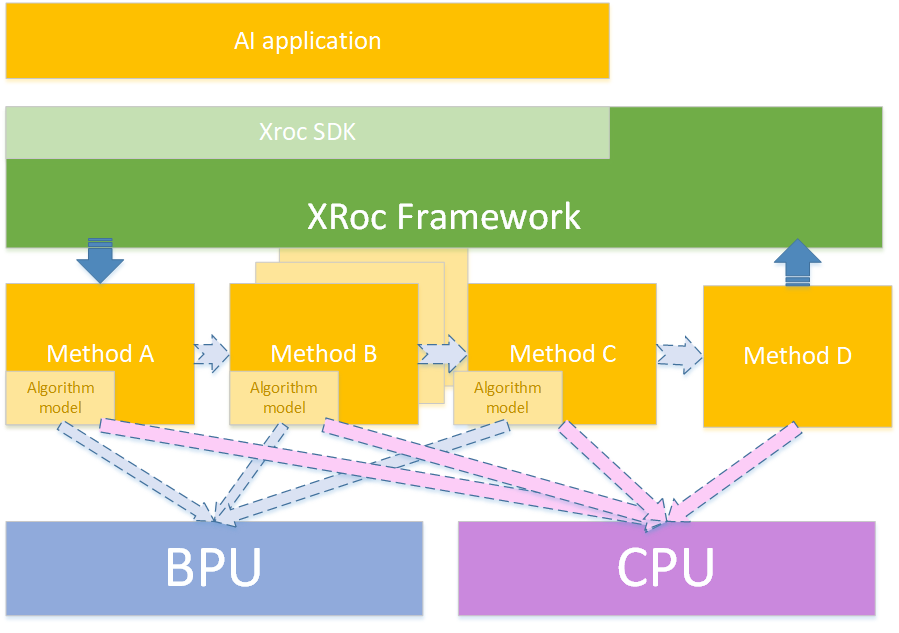

<!-- TOC -->

- [Overview](#overview)
    - [XRoc Framework解决什么问题](#xroc-framework解决什么问题)
    - [XRoc Frameowrk 概述](#xroc-frameowrk-概述)
        - [XRoc Framework核心模块](#xroc-framework核心模块)
- [XRoc-Framework 用户使用指南](#xroc-framework-用户使用指南)
    - [Build](#build)
        - [安装 cmake](#安装-cmake)
        - [编译](#编译)
        - [编译结果](#编译结果)
        - [环境信息](#环境信息)
    - [Step by step构建XRoc SDK](#step-by-step构建xroc-sdk)
        - [XRoc SDK接口定义](#xroc-sdk接口定义)
        - [XRoc SDK接口说明](#xroc-sdk接口说明)
            - [CreateSDK](#createsdk)
            - [SetConfig](#setconfig)
            - [Init](#init)
            - [UpdateCondig](#updatecondig)
            - [SetConfig](#setconfig-1)
            - [GetVersion](#getversion)
            - [SyncPredict](#syncpredict)
                - [SetCallback](#setcallback)
                - [AsyncPredict](#asyncpredict)
                - [SyncPredict2](#syncpredict2)
        - [XRoc SDK使用](#xroc-sdk使用)
            - [创建SDK](#创建sdk)
                - [设置XRoc配置初始化](#设置xroc配置初始化)
            - [XRoc SDK初始化](#xroc-sdk初始化)
            - [定义和设置 callback](#定义和设置-callback)
            - [异步运行-输入数据](#异步运行-输入数据)
            - [异步运行](#异步运行)
            - [同步运行-输入数据](#同步运行-输入数据)
            - [同步运行-输出数据](#同步运行-输出数据)
            - [异步运行-多路输出数据](#异步运行-多路输出数据)
            - [同步运行-多路输出数据](#同步运行-多路输出数据)
        - [include 文件列表](#include-文件列表)
        - [实现MethodFactory](#实现methodfactory)
        - [通过Config文件定义workflow](#通过config文件定义workflow)
            - [常用配置](#常用配置)
            - [指定线程优先级的配置](#指定线程优先级的配置)
            - [多路输出配置](#多路输出配置)
        - [数据类型](#数据类型)
            - [错误码](#错误码)
            - [基础数据结构](#基础数据结构)
                - [DataState](#datastate)
                - [BaseData](#basedata)
                - [BaseDataVector](#basedatavector)
                - [XRocData](#xrocdata)
                - [InputParam](#inputparam)
                - [DisableParam](#disableparam)
                - [SdkCommParam](#sdkcommparam)
                - [InputData](#inputdata)
                - [OutputData](#outputdata)
                - [XRocCallback](#xroccallback)

<!-- /TOC -->
# Overview
## XRoc Framework解决什么问题
降低算法模型，算法策略集成开发的门槛和难度。沉淀和积累智能化工程核心开发能力。


## XRoc Frameowrk 概述
XRoc-Framwork是一种基于数据流的SDK编程框架：   
1）可以通过JSON配置构建workflow，workflow是一个有向拓扑图，图中每个节点（Node）都管理了一个或多个同类型的method的实例；  
2）method表示一种能力，通常是某类模型能力（人脸检测、人脸Pose等）或者算法策略（过滤策略、融合策略、优选策略等）；  
3）workflow表示一个范式，定义了一组能力的串联方式，比如人脸检测、跟踪、属性（pose、blur等）以及优选等能力级联起来可以构建一个人脸抓拍范式；  
4）XRoc-Framework定义了一套面向workflow的通用sdk C++接口，通过设置不同的配置文件同一套接口可以运行不同的workflow。   


### XRoc Framework核心模块
|模块名称或名词  | 描述或解释  |
|:-----:   |:------|
|workflow  | workflow表示一个有向拓扑图，图中每个节点（Node）都管理着一个或多个method实例；workflow表示一个范式，定义了一组能力的串联方式，比如人脸检测、跟踪、属性（pose、blur等）以及优选等能力级联起来可以构建一个人脸抓拍范式；XRocSDK的SetConfig接口指定的配置文件定义了workflow组织方式。|
|XRocSDK   | 对外SDK类，定义了一套面向workflow的通用sdk C++接口，包含创建句柄、初始化、参数配置、同步/异步运行接口、设置回调函数等。|
|Scheduler | workflow的依赖引擎，记录各个Node之间的依赖关系，统一调度各个Node，确保各Node按序完成workflow任务。|
|Node      | 管理一个或多个同类型的method实例，同时负责任务的分发与后处理，另外根据method的属性可以完成帧的重排序，根据输入参数完成Node skip等。|
|MethodManager | 用来Node中Method的管理，包含实例创建、线程池构建及不同阶段调用method对应接口完成初始化、任务分发、参数配置等工作。 |
|Method    |  method表示一种能力，通常是某类模型能力（人脸检测、人脸Pose等）或者算法策略（过滤策略、融合策略、优选策略等）；作为一个独立模块，包含初始化、任务处理、参数配置等接口。 |
|FrameWork Data | 通过 SyncPredict或 AsyncPredict接口传入的一"帧"数据,并在Node之间流转,最后通过同步接口或异步回调返回的数据，称为Framework Data| 


# XRoc-Framework 用户使用指南
## Build 
### 安装 cmake
* ubunutu 环境
 `sudo apt-get install cmake`
* centos 环境
 `sudo yum -y install cmake`
### 编译
  `mkdir build`  
  `cd build & cmake ../`  
  `make`  

### 编译结果
 * example:
*bbox_filter_example*   
——以HobotXRoc::BBox为数据类型, 基于XRoc C++语言API编写的Example案例

  * unit test:
*config_test*   
—— 配置相关的单元测试
*cpp_api_test*  
—— C++ API的集中单元测试
*disable_method_test*  
—— 不同方式关闭特定method的单元测试
*node_test* 
—— 对Node节点的单元测试
*xroc_multisource_test* 
—— 对多路输入源的单元测试
*xroc_test* 
—— XRoc SDK接口额单元测试
*xroc_threadmodel_test* 
—— XRoc 线程模式(线程池运行方式)的单元测试
*xroc_threadorder_test*
—— XRoc 线程优先级的单元测试
*xroc_threadsafe_test*
—— XRoc 线程安全的单元测试
*xroc_callback_test*
—— XRoc callback回调的单元测试
*profiler_test*
—— XRoc profiler工具的单元测试

### 环境信息
X2：64位 gcc-linaro-6.5.0   

## Step by step构建XRoc SDK 
xroc给使用者提供了面向workflow的通用sdk接口，可以获取workflow中每个节点的输出结果。
c++语言版本 XRoc SDK接口定义在 include/hobotxsdk/xroc_sdk.h
### XRoc SDK接口定义
```c++
namespace HobotXRoc {
/**
 * 典型使用
 * HobotXRoc::XRocSDK *flow = HobotXRoc::XRocSDK::CreateSDK();
 * flow->SetConfig("config_file", config);
 * flow->Init();
 * InputDataPtr inputdata(new InputData());
 * // ... 构造输入数据
 * auto out = flow->SyncPredict(inputdata);
 * // PrintOut(out);
 * // ... 处理输出结果
 * delete flow;
 */

/// 数据流提供的接口
class XRocSDK {
 public:
  /// 因为构造出来的实例是XRocSDK接口的子类
  virtual ~XRocSDK() {}
  /// 通过此方法构造SDK实例
  static XRocSDK *CreateSDK();

  /// key：config_file，用来设置workflow配置文件路径
  virtual int SetConfig(
      const std::string &key,
      const std::string &value) = 0;  // 设置授权路径、模型路径等等
  /// 初始化workflow
  virtual int Init() = 0;
  /// 针对node更新配置参数
  virtual int UpdateConfig(const std::string &node_name,
                           InputParamPtr ptr) = 0;
  /// 获取node当前配置
  virtual InputParamPtr GetConfig(const std::string &node_name) const = 0;
  /// 获取node的版本号
  virtual std::string GetVersion(const std::string &node_name) const = 0;
  /// 同步运行接口，单路输出
  virtual OutputDataPtr SyncPredict(InputDataPtr input) = 0;
  /// 同步运行接口，多路输出
  virtual std::vector<OutputDataPtr> SyncPredict2(InputDataPtr input) = 0;
  /**
   *  异步接口的callback设置接口
   *
   * 需要在Init()后执行，否则name不为空时无法得到结果
   * @param callback [in], 回调函数
   * @param name [in], workflow 节点
   * unique_name，当使用默认参数时，callback为全局回调，
   *    只有当这一帧数据全部计算结束才会回调报告结果；如果设置了unique_name，则在异步调用中就会
   *    上报当前节点的输出，但同步运行中不会回调。
   */
  virtual int SetCallback(XRocCallback callback,
                          const std::string &name = "") = 0;  // 设置回调
  /// 异步运行接口
  virtual int64_t AsyncPredict(InputDataPtr input) = 0;  // 异步接口
};
}  // namespace HobotXRoc
```
### XRoc SDK接口说明
#### CreateSDK
`static XRocSDK *CreateSDK();`   
 说明：通过该接口创建XRoc的实例。

#### SetConfig
`virtual int SetConfig(const std::string &key, const std::string &value) = 0;`   
说明：用于设置整个workflow的配置，目前支持的功能有：  
1）key为"config_file"，value设置为workflow的配置路径，用于设置整个workflow的配置文件。   
2）key为"profiler"，value为"on"，表示打开性能统计功能。"off"表示关闭, 默认为关闭。   
3）key为"profiler_file",value为性能统计输出文件路径，用于设置性能统计文件的路径名称，默认为./profiler.txt   
4）key为"free_framedata", value为"on", 表示尽早地释放掉在后面node节点中不再需要使用的Framework Data中的某项数据。   
打开此项配置,可以减少峰值内存使用。"off"表示关闭, 默认为关闭。   

#### Init
`virtual int Init() = 0;`
说明：用于初始化xroc句柄，必须在调用SetConfig之后执行Init()

#### UpdateCondig
`virtual int UpdateConfig(const std::string &node_name, InputParamPtr ptr) = 0;`  
说明：用于设置node的参数，最终会通过调用对应的Node管理的method实例的UpdateParameter(InputParamPtr ptr)接口，完成参数的更新。
形参node_name传入node的名字；形参ptr为该node对应的配置信息

#### SetConfig
`virtual InputParamPtr GetConfig(const std::string &node_name) const = 0;`  
说明：获取某个node的参数，最终会调用对应的Node管理的method实例的GetParameter()返回配置信息。

#### GetVersion
`virtual std::string GetVersion(const std::string &node_name) const = 0;`
说明：获取node对应method的版本信息。

#### SyncPredict
`virtual OutputDataPtr SyncPredict(InputDataPtr input) = 0;`
说明：同步运行接口，传⼊数据，接口会阻塞住，直到整个workflow处理完成，将workflow的结果通过函数返回值返回为止。
该接口需要在Init()之后执行才有效。

##### SetCallback
`virtual int SetCallback(XRocCallback callback, const std::string &name = "") = 0;`
说明：使用异步运行接口时，设置SetCallback才有效。
将name设置为默认值，通过该接口可以设置整个workflow处理完成后的回调函数；
将name设置为某个node的unique名字，通过该接口可以设置该node处理数据完成后的回调函数。

##### AsyncPredict
`virtual int64_t AsyncPredict(InputDataPtr input) = 0;`
说明：异步运行接口，结果通过SetCallback设置的回调函数捕获。AsyncPredict接口调用后立即返回。
该接口需要在Init()之后执行才有效。

##### SyncPredict2
`virtual std::vector<OutputDataPtr> SyncPredict2(InputDataPtr input) = 0;`
说明: 同步多路输出的场景下， 输出接口可以通过output_type_信息判断输出类型。

### XRoc SDK使用
* Example 异步运行模式   
**以下代码中出现的ASSERT_TRUE, EXPECT_EQ, ASSERT_EQ等，来源于googletest。**
**用于对返回值结果等做一些检查，实际应用中不需要使用。**    
如以下代码所示: 
```c
  auto xroc = HobotXRoc::XRocSDK::CreateSDK();
  ASSERT_TRUE(xroc);
  XRocAPITest::Callback callback;

  EXPECT_EQ(0, xroc->SetConfig("config_file", "./test/configs/basic.json"));
  EXPECT_EQ(0, xroc->SetConfig("profiler", "on"));
  EXPECT_EQ(0, xroc->SetConfig("profiler_file", "./profiler.txt"));
  EXPECT_EQ(0, xroc->Init());
  ASSERT_EQ(0, xroc->SetCallback(
    std::bind(&XRocAPITest::Callback::OnCallback,
      &callback,
      std::placeholders::_1)));
  ASSERT_EQ(0, xroc->SetCallback(
    std::bind(&XRocAPITest::Callback::OnCallback,
      &callback,
      std::placeholders::_1),
    "first_method"));
  HobotXRoc::InputDataPtr inputdata(new HobotXRoc::InputData());
  auto xroc_input_data = std::make_shared<HobotXRoc::BaseData>();
  xroc_input_data->name_ = "global_in";
  xroc_input_data->state_ = HobotXRoc::DataState::INVALID;
  inputdata->datas_.emplace_back(xroc_input_data);
  PromiseType p;
  auto f = p.get_future();
  inputdata->context_ = &p;
  std::string node_name = "first_method";
  auto ipp = std::make_shared<HobotXRoc::TestParam>(node_name);

  xroc->AsyncPredict(inputdata);
  auto output = f.get();
  EXPECT_EQ(output->error_code_, 0);
  EXPECT_EQ(output->datas_.size(), inputdata->datas_.size());
  EXPECT_EQ(output->datas_.front()->state_, inputdata->datas_.front()->state_);
  delete xroc;
```
* Example 同步运行模式
如以下代码所示:
```c
  auto xroc = HobotXRoc::XRocSDK::CreateSDK();
  ASSERT_TRUE(xroc);
  EXPECT_EQ(0, xroc->SetConfig("config_file", "./test/configs/basic.json"));
  EXPECT_EQ(0, xroc->Init());
  HobotXRoc::InputDataPtr inputdata(new HobotXRoc::InputData());
  auto xroc_input_data = std::make_shared<HobotXRoc::BaseData>();
  xroc_input_data->name_ = "global_in";
  xroc_input_data->state_ = HobotXRoc::DataState::INVALID;
  inputdata->datas_.emplace_back(xroc_input_data);
  auto output = xroc->SyncPredict(inputdata);
  EXPECT_EQ(output->error_code_, 0);
  EXPECT_EQ(output->datas_.size(), inputdata->datas_.size());
  EXPECT_EQ(output->datas_.front()->state_, inputdata->datas_.front()->state_);
```
#### 创建SDK
  调用XRocSDK的class静态接口CreateSDK, 创建一个XRocSDK的对象。
代码:
```c
auto xroc = HobotXRoc::XRocSDK::CreateSDK();
```
接口:
```c
static XRocSDK *CreateSDK();
```

##### 设置XRoc配置初始化
代码:
```c
EXPECT_EQ(0, xroc->SetConfig("config_file", "./test/configs/basic.json"));
EXPECT_EQ(0, xroc->SetConfig("profiler", "on"));
EXPECT_EQ(0, xroc->SetConfig("profiler_file", "./profiler.txt"));
EXPECT_EQ(0, xroc->SetConfig("free_framedata", "on"));
```

接口:
```c
virtual int SetConfig(const std::string &key, const std::string &value) = 0
```
#### XRoc SDK初始化
根据前面几步的配置，初始化XRoc。
```c
xroc->Init()
```
#### 定义和设置 callback
* 定义用户的Callback类,实现一个类似OnCallback函数，参数类型为
  `HobotXRoc::OutputDataPtr output`，用来处理XRoc workflow的回调结果
代码:

```c 
class CallbackExample {
 public:
  void OnCallback(HobotXRoc::OutputDataPtr output) {
    ASSERT_TRUE(output);
    ASSERT_TRUE(output->context_);
    std::cout << "======================" << std::endl;
    std::cout << "seq: " << output->sequence_id_ << std::endl;
    std::cout << "output_type: " << output->output_type_ << std::endl;
    std::cout << "node_name: " << output->node_name_ << std::endl;
    std::cout << "error_code: " << output->error_code_ << std::endl;
    std::cout << "error_detail_: " << output->error_detail_ << std::endl;
    std::cout << "datas_ size: " << output->datas_.size() << std::endl;
    for (auto data : output->datas_) {
      if (data->error_code_ < 0) {
        std::cout << "data error: " << data->error_code_ << std::endl;
        continue;
      }
      std::cout << "data type_name : " << data->type_ << " " << data->name_
                << std::endl;
      BaseDataVector *pdata = reinterpret_cast<BaseDataVector *>(data.get());
      std::cout << "pdata size: " << pdata->datas_.size() << std::endl;
    }
  }
};
```

  * 设置callback
```c
MethodCallback::Callback callback;
xroc->SetCallback(
  std::bind(&MethodCallback::Callback::OnCallback,
    &callback,
    std::placeholders::_1));
```

#### 异步运行-输入数据
   * datas_: workflow输入的数据数组，要求非空。vector中每个数据对应一个数据slot，会送给workflow的
相关node，作为它们的输入。 在CV场景下，输入数据一般来源于senser或ISP处理后的视频帧数据。
   * params_: 对应请求的参数数组，可以为空。vector中每个数据对应一个具体node的参数。
   * source_id_: 在多路输入的场景下用于分输入源,单一源情况赋值为 0
   * context_: 透传的数据，该数据会透传到OutputData::context_字段, 通过该参数, 可以建立输入数据和输出数据的对应关系。
```c
/// 输入数据类型
struct InputData {
  /// 用户输入的数据，比如图片channel、时间戳、框等等。
  std::vector<BaseDataPtr> datas_;
  /// 当前请求自定义的参数
  std::vector<InputParamPtr> params_;
  /// 数据源 id 用于多路输入时区分输入源,单一源情况赋值为 0
  uint32_t source_id_ = 0;
  /// 透传的数据，该数据会透传到OutputData::context_ 字段
  const void *context_ = nullptr;
};
```
  调用异步接口AsyncPredict给XRoc SDK传入数据。

```c
  /*模拟准备数据*/
  HobotXRoc::InputDataPtr inputdata(new HobotXRoc::InputData());
  auto xroc_input_data = std::make_shared<HobotXRoc::BaseData>();
  xroc_input_data->name_ = "image";
  xroc_input_data->state_ = HobotXRoc::DataState::INVALID;
  /*datas_在正式场景下需要填入真实数据*/
  inputdata->datas_.emplace_back(xroc_input_data);
  /*context_绑定输出结果*/
  PromiseType p;
  auto f = p.get_future();
  inputdata->context_ = &p;
```

#### 异步运行
* 异步运行
```c
  /*调用异步运行接口*/
  xroc->AsyncPredict(inputdata);
```

#### 同步运行-输入数据
与异步模式相比, 处理结果直接通过SyncPredict返回。
```c
  HobotXRoc::InputDataPtr inputdata(new HobotXRoc::InputData());
  auto xroc_input_data = std::make_shared<HobotXRoc::BaseData>();
  xroc_input_data->name_ = "global_in";
  xroc_input_data->state_ = HobotXRoc::DataState::INVALID;
  inputdata->datas_.emplace_back(xroc_input_data);
```

#### 同步运行-输出数据
调用 SyncPredict，直接返回运行的结果
```c
  auto output = xroc->SyncPredict(inputdata);
```

返回数据的结构:
```c
/// 输出数据类型
struct OutputData {
  /// 错误码
  int error_code_ = 0;
  /// 错误信息
  std::string error_detail_ = "";
  /// 当该OutputData为给某个node的定向回调结果时，该字段用于指示node的unique名称
  std::string node_name_ = "";
  /// 多路输出结果名称
  std::string output_type_ = "";
  /// 输出结果
  std::vector<BaseDataPtr> datas_;
  /// 从InputData透传过来的数据
  const void *context_ = nullptr;
  /// 该结果的序列号
  int64_t sequence_id_ = 0;
  /// 该结果是属于那个输入源产生的结果
  uint32_t source_id_ = 0;
  uint64_t global_sequence_id_ = 0;
};
typedef std::shared_ptr<OutputData> OutputDataPtr;
```
#### 异步运行-多路输出数据
在接口使用上，与普通方式下没有区别，仅在回调函数如OnCallback中需注意，需要对output->datas_遍历，通过 output->output_type判断是否是目标group结果数据。 

#### 同步运行-多路输出数据
调用同步多路预测接口SyncPredict2，接口会阻塞住，直到整个workflow处理完成返回output的数组。里面包括多路数据结果，可以通过OutputData的output_type_字段区分。
```c
 for (int i = 0; i < 10; i++) {
    auto out = flow->SyncPredict2(inputdata);
    for (auto single_out : out) {
      callback.OnCallback(single_out);
    }
    std::this_thread::sleep_for(std::chrono::milliseconds(10));
    if (i == 5) {
      std::string node_name("BBoxFilter_1");
      auto ptr = std::make_shared<HobotXRoc::FilterParam>(node_name);
      ptr->SetThreshold(90.0);
      flow->UpdateConfig(ptr->node_name_, ptr);
    }
  }
```

### include 文件列表
|目录|文件名|功能|
|:-----:|:------:|:------:|
|hobotxroc|method.h|C++版头文件，定义了Method的基类|
|hobotxroc|method_factory.h|C++版头文件，定义了Method工厂类基类|
|hobotxroc|profiler.h|C++版头文件，定义了性能统计相关的类与宏|
|hobotxsdk|version.h|C版头文件，声明了XRoc-Framework的版本信息
|hobotxsdk|xroc_data.h|C++版头文件，定义了xroc-framework的数据类型、参数类型以及sdk输出的数据类型 |
|hobotxsdk|xroc_error.h|定义了xroc-framework错误码 |
|hobotxsdk|xroc_sdk.h|C++版头文件，定义了sdk的接口，包含同步运行接口与异步运行接口|

### 实现MethodFactory
 XRoc在Init过程中需要调用method的工厂函数完成实例创建，MethodFactory的工厂函数会根据不同的method type名字返回对应的method的实例，workflow中用到的method都需要添加到该函数中，不然在构建sdk时会失败。   
 MethodFactory类定义在include/hobotxroc/method_factory.h中。
 ```c
 /// Method 工厂方法
  static MethodPtr CreateMethod(const std::string &method_name);
 ``` 
  实现CreateMethod方法， 在这个函数中根据method_name,返回具体的method实例。 method_name来源于Config文件中的method_type字段
 ```c
namespace HobotXRoc {
MethodPtr MethodFactory::CreateMethod(const std::string &method_name) {
  if ("TestMethod" == method_name) {
    return MethodPtr(new TestMethod());
  } else if ("BBoxFilter" == method_name) {
    return MethodPtr(new BBoxFilter());
  } else if ("OrderTestMethod" == method_name) {
    return MethodPtr(new OrderTestThread());
  } else if ("threadsafeMethod" == method_name) {
    return MethodPtr(new SafeTestThread());
  } else if ("passthroughMethod" == method_name) {
    return MethodPtr(new passthroughMethod());
  } else {
    return MethodPtr();
  }
}
}  // namespace HobotXRoc
 ```
### 通过Config文件定义workflow
#### 常用配置
```json
{
  "inputs": ["face_head_box"],
  "outputs": ["face_head_box_filter2"],
  "workflow": [
    {
      "thread_count": 3,
      "method_type": "BBoxFilter",
      "unique_name": "BBoxFilter_1",
      "inputs": [
        "face_head_box"
      ],
      "outputs": [
        "face_head_box_filter"
      ],
      "method_config_file": "null"
    },
    {
      "thread_count": 3,
      "method_type": "BBoxFilter",
      "unique_name": "BBoxFilter_2",
      "inputs": [
        "face_head_box_filter"
      ],
      "outputs": [
        "face_head_box_filter2"
      ],
      "method_config_file": "null"
    }
  ]
}
```
*说明*

**inputs** : 
	workflow的input数据名称:
    对应于以下代码中的name_   
```c 
   auto xroc_input_data = std::make_shared<HobotXRoc::BaseData>();
   xroc_input_data->name_ = "face_head_box";
   xroc_input_data->state_ = HobotXRoc::DataState::INVALID;
```                              
**outputs** : 
    workflow的output数据名称:
    对应于callback返回中的  `data->name_`
```c 
    workflow的output 参数。
 for (auto data : output->datas_) {
      std::cout << "output name：" << data->name_
                << std::endl;
      BaseDataVector *pdata = reinterpret_cast<BaseDataVector *>(data.get());
      std::cout << "pdata size: " << pdata->datas_.size() << std::endl;
    }
```  
**workflow**:           
    定义worflow拓扑结构, 由node的数组组成。

**子workflow**:
[XRoc-Framework 子workflow说明](./doc/SubWorkflow.md)

***Node***   
**——thread_count** :   
    设置node的执行线程数量，在method属性thread_safe=false的情况下，会创建thread_count的method实例，连续多次输入，默认会按Round-bin的方式分发到对应线程（或实例）。如果在Node内部执行时存在阻塞操作，如调用BPU接口进行模型计算时，增加thread_count值，有可能可以提高workflow的整体性能。
    
**——method_type** :    
    method_type 对应于MethodFactory::CreateMethod 中的method_name，
    
**——unique_name**
    node的唯一名称，同一种类型的method可以实例化多个不同的Node，通过unique_name来区分。

**——inputs**
    该Node的输入。

**——outputs**
    该Node输出数据。
*注：Node的inputs,和outputs属性，决定了数据的流向，从而确定了node的在workflow类AOV网中的关系。  
**——method_config_file**
    指定method局部配置文件路径;路径是workflow配置文件所在位置的相对路径。
*注 指定的是配置文件路径，在method::Init中需要从该路径重新读取进而解析Json config信息。
```c 
       /// 初始化
  virtual int Init(const std::string &config_file_path) = 0;
``` 

#### 指定线程优先级的配置
以下的workflow config文件中，对thread线程的设置与上面不同，通过thread_list设置Node的执行线程数，并可通过thread_priority来设置不同的线程优先级。
```json
{
  "inputs": ["face_head_box"],
  "outputs": ["face_head_box_filter2"],
  "optional":
  {
    "sched_upper":
    {
      "policy": "SCHED_FIFO",
      "priority": 30
    },
    "sched_down":
    {
      "policy": "SCHED_FIFO",
      "priority": 30
    }
  },
  "workflow": [
    {
      "thread_list": [0],
      "thread_priority":
      {
        "policy": "SCHED_FIFO",
        "priority": 10
      },
      "method_type": "BBoxFilter",
      "unique_name": "BBoxFilter_1",
      "inputs": [
        "face_head_box"
      ],
      "outputs": [
        "face_head_box_filter"
      ],
      "method_config_file": "sched_fifo0.json"
    },
    {
      "thread_list": [1, 2],
      "thread_priority":
      {
        "policy": "SCHED_FIFO",
        "priority": 20
      },
      "method_type": "BBoxFilter",
      "unique_name": "BBoxFilter_2",
      "inputs": [
        "face_head_box_filter"
      ],
      "outputs": [
        "face_head_box_filter2"
      ],
      "method_config_file": "sched_fifo1.json"
    }
  ]
}
``` 
| thread priority成员 | 值     |  详细说明|
|:-----------|:-------|:-------|
| policy     |  SCHED_OTHER or SCHED_NORMAL:  | linux默认调度优先级，分时调度策略、CFS（Completely Fair Scheduler,完全公平调度策略），Ready的线程在等待队列等待时间越长，优先级越高；|
|            | SCHED_FIFO | 1）是一种实时调用策略，优先级高于SCHED_OTHER；可设置线程优先级范围1~99，值越大优先级越高；当SCHED_FIFO的线程状态为runable时，会立即抢占SCHED_OTHER的线程; 2）如果一个SCHED_FIFO线程被一个更高优先级的线程抢占，该线程会放在相同优先级线程的队首；当一个SCHED_FIFO的线程状态变成runnable时，该线程放在相同优先级线程的队尾；3）一个SCHED_FIFO时一种不带时间片的先入先出调度策略；让出cpu要么因为本身被IO blocked，要么被更高优先级线程给抢占了，要么自己主动调了sched_yield让出cpu  |
|          | SCHED_RR   | 1）也是一种实时调度策略，优先级高于SCHED_OTHER；可设置线程优先级范围1~99，值越大优先级越高；2）SCHED_RR调度策略本身是SCHED_FIFO的简单增强版，两者大部分属性是一样的；区别在于对于相同优先级的线程，SCHED_RR对于相同优先级的线程也是采用时间片轮转的方式，一个线程做完自己的时间片之后就放在该优先级线程的队尾，反之SCHED_FIFO不会主动让出线程；|
|          | SCHED_BATCH | SCHED_BATCH是为批处理任务设计的优先级调度策略，SCHED_IDLE的线程优先级特别低；跟SCHED_OTHER调度策略一样，优先级恒为0，不能设置； |
|          | SCHED_BATCH  | SCHED_DEADLINE顾名思义，是一种可以给线程设置deadline的调度策略；
| priority   |   1~99     | 仅在 policy 设置为 SCHED_FIFO， SCHED_RR 时可以设置|     

**optional**   
**——sched_upper** : workflow调度线程   
**——sched_down** :  workflow中Node的公共守护线程   ***   
***如果设置线程优先级，建议这两个线程的优先级高于每个method node的线程优先级***   
***Node***   
**——thread_list** :  指定了Node执行线程index的数组，基于thread_list可以实现多个Node之间共享执行线程。   
**——thread_priority** : 线程的优先级设置。  
 
```json
"thread_list": [0],
      "thread_priority":
      {
        "policy": "SCHED_FIFO",
        "priority": 10
      },
```

#### 多路输出配置
多路输出应用于这样的场景: FrameWork数据在一些node运行结束后，产生了一些workflow所需的output数据。这些output数据，如果按通常的配置方法，要等到所有workflow中所有node运行完成后，Xroc的调用者才能通过异步回调，或者同步运行后获取结果。这样，调用者获得目标结果的数据会相对比较晚。多路输出功能，为缩短一些output数据的返回时间，提供这样的机制，用户可以将输出数据分为多路输出，但某路数据经过一些Node，达到完成状态时，即可通过回调函数返回结果，即使这路数据还要参与后续的Node计算。多路输出一般配合XRoc SDK的异步调用方式使用。
```json
{
  "inputs": ["face_head_box"],
  "outputs": [
    {
      "output_type": "out1",
      "outputs":["face_head_box_filter"]
    },
    {
      "output_type": "out2",
      "outputs":["face_head_box_filter2"]
    }
  ],
  "workflow": [
    {
      "thread_count": 3,
      "method_type": "BBoxFilter",
      "unique_name": "BBoxFilter_1",
      "inputs": [
        "face_head_box"
      ],
      "outputs": [
        "face_head_box_filter"
      ],
      "method_config_file": "null"
    },
    {
      "thread_count": 3,
      "method_type": "BBoxFilter",
      "unique_name": "BBoxFilter_2",
      "inputs": [
        "face_head_box_filter"
      ],
      "outputs": [
        "face_head_box_filter2"
      ],
      "method_config_file": "null"
    }
  ]
}
```
每帧数据FrameWork Data有序列号sequence_id标记，还需增加每路输出OutputData的唯一标记output_type_，在config文件中获取。
多路输出的Json配置方式为：
```json
 "outputs": [
    {
      "output_type": "out1",
      "outputs":["face_head_box_filter"]
    },
    {
      "output_type": "out2",
      "outputs":["face_head_box_filter2"]
    }
  ],
```
### 数据类型
#### 错误码
```c++
// xroc_error.h
#define HOBOTXROC_ERROR_CODE_OK  0

#define HOBOTXROC_ERROR_INPUT_INVALID               -1000
#define HOBOTXROC_ERROR_EXCEED_MAX_RUNNING_COUNT    -1001

#define HOBOTXROC_ERROR_METHOD              -2000
#define HOBOTXROC_ERROR_METHOD_TIMEOUT      -2001
#define HOBOTXROC_ERROR_OUTPUT_NOT_READY    -2002
```

#### 基础数据结构
##### DataState
```c++
// xroc_data.h
enum class DataState {
  VALID = 0,
  FILTERED = 1,
  INVISIBLE = 2,
  DISAPPEARED = 3,
  INVALID = 4,
};
```
说明：用于描述数据的状态   

|成员|详细说明|
|:-----:|:------:|
|VALID  |数据有效|
|FILTERED|表示该数据被过滤模块过滤掉了|
|INVISIBLE|表示该数据对应的对象未检测出来，但是可以根据前后帧的关系推测出来|
|DISAPPEARED |表示该数据对应的对象消失了，不在跟踪状态中了|
|INVALID |表示数据无效|
##### BaseData
```c++
// xroc_data.h
struct BaseData {  // 数据结构基类，框，lmk等等的基类
  BaseData();
  virtual ~BaseData();

  std::string type_ = "";
  std::string name_ = "";
  int error_code_ = 0;
  std::string error_detail_ = "";
  std::shared_ptr<CContext> c_data_;
  DataState state_ = DataState::VALID;
};

typedef std::shared_ptr<BaseData> BaseDataPtr;
```
说明： XRoc数据交互的基础数据类型，包含了数据的类型、状态等描述信息，workflow中流通的message都需要继承该基类。 

|成员|详细说明|
|:-----:|:------:|
|type_ |数据类型描述字符串|
|name_ |数据名称，用于workflow的串联，workflow配置文件中需要使用|
|error_code_ |错误码|
|error_detail_ |错误描述字符串|
|c_data_ |用于获取C语言接口SDK内部上下文信息|
|state_ |数据状态信息|
##### BaseDataVector
```c++
// xroc_data.h
struct BaseDataVector : public BaseData {
  BaseDataVector();

  std::vector<BaseDataPtr> datas_;
};
```
说明： 用于表示一组数据，比如一张图片的多个检测框之类。

|成员|详细说明|
|:-----:|:------:|
|datas_ |vector用于保存数组数据，数组中每个成员抽象为BaseData类型的指针|
##### XRocData
```c++
// xroc_data.h
template<typename Dtype>
struct XRocData : public BaseData {
  Dtype value;
};
```
说明: 模版类，用于将已有的数据类型转换成BaseData类型
##### InputParam
```c++
// xroc_data.h
class InputParam {  // 输入数据的自定义参数
 public:
  explicit InputParam(std::string node_name) {
    node_name_ = node_name;
    is_json_format_ = false;
    is_enable_this_node_ = true;
  }
  virtual ~InputParam() = default;
  virtual std::string Format() = 0;

 public:
  bool is_json_format_;
  bool is_enable_this_node_;
  std::string node_name_;
};

typedef std::shared_ptr<InputParam> InputParamPtr;
```
说明： 用于定义输入参数。  

|成员|详细说明|
|:-----:|:------:|
|is_json_format_ | 输入参数是否是json字符串。若是json字符串，可以通过Format()接口获取字符串 |
|is_enable_this_node_ | 是否使能该字符串。若不使能该node，则workflow运行过程中不会调用该node的DoProcess接口，此时该node的输出可以使用传入的预设的node输出或者直接透传前一个node的结果  | 
|node_name_ | node的unique名称|
|Format() | 返回具体的参数字符串|
##### DisableParam
```c++
// xroc_data.h
class DisableParam : public InputParam {
 public:
  enum class Mode {
    /// 输入数据透传到输出，要求输入输出大小一致
    PassThrough,
    /// 拷贝先验数据到输出，要求先验数据大小与输出大小一致
    UsePreDefine,
    /// 令每个输出都是INVALID的BaseData
    Invalid
  };
  explicit DisableParam(const std::string &
  node_name, Mode mode = Mode::Invalid) : InputParam(node_name), mode_{mode} {
    is_enable_this_node_ = false;

  }
  virtual ~DisableParam() = default;
  virtual std::string Format() {
    return node_name_ + " : disabled";
  }
  Mode mode_;
  /// 先验数据，用于填充Node输出
  std::vector<BaseDataPtr> pre_datas_;
};

typedef std::shared_ptr<DisableParam> DisableParamPtr;
```
说明：一种特定的输入参数，用于控制Node Skip条件，目前支持Disable、passthrough、UserPredefined三种Skip条件。   

|成员|详细说明|
|:-----:|:------:|
|mode_ | 表示使用数据透传方式还是使用用户传入的先验结果作为该node的输出 |
|pre_datas_ | 若用户需要传入的先验结果作为该node的输出，则通过该成员变量保存先验结果 |
##### SdkCommParam
```c++
// xroc_data.h
class SdkCommParam : public InputParam {
 public:
  SdkCommParam(std::string node_name, std::string param) : InputParam(node_name) {
    param_ = param;
    is_json_format_ = true;
  }
  virtual std::string Format() { return param_; }
  virtual ~SdkCommParam() = default;

 public:
  std::string param_;   // json格式
};
typedef std::shared_ptr<SdkCommParam> CommParamPtr;
```
说明： 一种Json格式的框架通用输入参数类型。  

|成员|详细说明|
|:-----:|:------:|
|param_ |json字符串格式的参数类型|

##### InputData
```c++
// xroc_data.h
struct InputData {  // 输入数据类型
  std::vector<BaseDataPtr>
      datas_;  // 用户输入的数据，比如图片channel、时间戳、框等等
  std::vector<InputParamPtr> params_;  // 当前请求自定义的参数

  const void *context_ = nullptr;
};
typedef std::shared_ptr<InputData> InputDataPtr;
```
说明：XRoc-Framework同步运行与异步运行接口传入的输入数据，包含数据、控制参数等。   

|成员|详细说明|
|:-----:|:------:|
|datas_ | workflow输入的数据，要求非空。vector中每个数据对应一个数据slot，会送给workflow的相关node，作为它们的输入。|
|params_ | 对应请求的参数，可以为空。vector中每个数据对应一个具体node的参数。|
 
##### OutputData
```c++
// xroc_data.h
struct OutputData {
  /// 错误码
  int error_code_ = 0;
  /// 错误信息
  std::string error_detail_ = "";
  /// 当该OutputData为给某个node的定向回调结果时，该字段用于指示node的unique名称
  std::string node_name_ = "";
  /// 多路输出结果名称
  std::string output_type_ = "";
  /// 输出结果
  std::vector<BaseDataPtr> datas_;
  /// 从InputData透传过来的数据
  const void *context_ = nullptr;
  /// 该结果的序列号
  int64_t sequence_id_ = 0;
  /// 该结果是属于那个输入源产生的结果
  uint32_t source_id_ = 0;
  uint64_t global_sequence_id_ = 0;
};
typedef std::shared_ptr<OutputData> OutputDataPtr;
typedef std::shared_ptr<OutputData> OutputDataPtr;
```
说明： XRoc-Framework同步运行与异步运行接口返回的输出结果；也可以作为单个Node处理完返回的结果，供对应的回调函数捕获

|成员|详细说明|
|:-----:|:------:|
|error_code_ | 错误码，无错误则应为0 |
|error_detail_ | 错误描述信息 |
|node_name_ | node名称，对于XRoc-Framework同步运行与异步运行接口返回的输出结果，该字段为空 |
|output_type_| 返回的输出类型信息，多路输出情况下对应workflow outputs中定义的type信息，单路输出类型为"__NODE__WHOLE_OUTPUT__ "|
|datas_ | 返回的具体数据结果 |
|context_ | 分析任务传递的用户数据，在结果中会进行透传回来 |

##### XRocCallback
```c++
typedef std::function<void(OutputDataPtr)> XRocCallback;
```
说明： xRoc-Framework支持的回调函数格式：返回值为void，有且只有一个形参，形参类型为OutputDataPtr