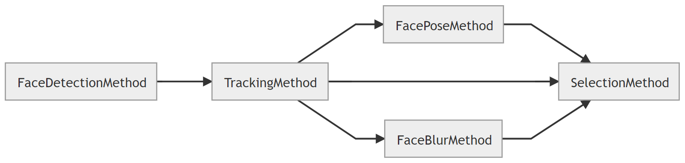

# Overview  

## XRoc Framework是什么
XRoc-Framework是一种基于数据流的SDK编程框架：  
1）可以通过JSON配置构建一个workflow，workflow是一个有向拓扑图，图中每个节点（Node）都是一个或多个method实例;    
2）method表示一种能力，能力通常是某类模型能力（人脸检测、人脸Pose等）或者算法策略（过滤策略、融合策略、优选策略等）;  
3）workflow表示一个范式，定义一组能力的串联方式，如下图定义了人脸抓拍范式，其中融合了检测、跟踪、人脸属性（pose、blur）以及优选策略等能力;  
4）XRoc-Framework定义了一套通用SDK C++接口。



# Reference 

如何使用xroc framework样例代码。

# BUILD

## How to build

编译前请确任已经安装了x2工具链和CMake。根据平台，直接运行每个Stage的子目录下的shell编译脚本即可编译。
例如：

```bash
./stage1/build.sh
```


## [Stage1](./stage1)
Step-by-step 创建xroc SDK。

## Stage2
创建多线程实例。


