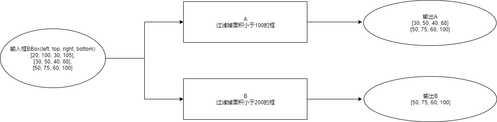

<!-- TOC -->

- [BUILD](#build)
- [Hello World！](#hello-world)
  - [Sample 功能描述](#sample-%e5%8a%9f%e8%83%bd%e6%8f%8f%e8%bf%b0)
  - [开发BBoxFilter Method](#%e5%bc%80%e5%8f%91bboxfilter-method)
      - [定义method输入输出数据类型](#%e5%ae%9a%e4%b9%89method%e8%be%93%e5%85%a5%e8%be%93%e5%87%ba%e6%95%b0%e6%8d%ae%e7%b1%bb%e5%9e%8b)
      - [将数据封装为XRoc数据表示](#%e5%b0%86%e6%95%b0%e6%8d%ae%e5%b0%81%e8%a3%85%e4%b8%baxroc%e6%95%b0%e6%8d%ae%e8%a1%a8%e7%a4%ba)
      - [继承Method基类，实现BBoxFilter Method](#%e7%bb%a7%e6%89%bfmethod%e5%9f%ba%e7%b1%bb%e5%ae%9e%e7%8e%b0bboxfilter-method)
  - [通过JSON构建workflow](#%e9%80%9a%e8%bf%87json%e6%9e%84%e5%bb%baworkflow)
  - [基于已定义的method及Json workflow配置文件构建SDK](#%e5%9f%ba%e4%ba%8e%e5%b7%b2%e5%ae%9a%e4%b9%89%e7%9a%84method%e5%8f%8ajson-workflow%e9%85%8d%e7%bd%ae%e6%96%87%e4%bb%b6%e6%9e%84%e5%bb%basdk)
      - [注册BBoxFilter Method到MethodFactory中](#%e6%b3%a8%e5%86%8cbboxfilter-method%e5%88%b0methodfactory%e4%b8%ad)
      - [基于Json workflow配置构建SDK(同步预测接口)](#%e5%9f%ba%e4%ba%8ejson-workflow%e9%85%8d%e7%bd%ae%e6%9e%84%e5%bb%basdk%e5%90%8c%e6%ad%a5%e9%a2%84%e6%b5%8b%e6%8e%a5%e5%8f%a3)
        - [创建SDK句柄:](#%e5%88%9b%e5%bb%basdk%e5%8f%a5%e6%9f%84)
        - [设置XRoc配置初始化](#%e8%ae%be%e7%bd%aexroc%e9%85%8d%e7%bd%ae%e5%88%9d%e5%a7%8b%e5%8c%96)
        - [Init](#init)
        - [GetVersion](#getversion)
        - [产生输入数据](#%e4%ba%a7%e7%94%9f%e8%be%93%e5%85%a5%e6%95%b0%e6%8d%ae)
        - [调用同步预测接口SyncPredict](#%e8%b0%83%e7%94%a8%e5%90%8c%e6%ad%a5%e9%a2%84%e6%b5%8b%e6%8e%a5%e5%8f%a3syncpredict)
        - [解析结果](#%e8%a7%a3%e6%9e%90%e7%bb%93%e6%9e%9c)
      - [基于Json workflow配置构建SDK(异步预测接口)](#%e5%9f%ba%e4%ba%8ejson-workflow%e9%85%8d%e7%bd%ae%e6%9e%84%e5%bb%basdk%e5%bc%82%e6%ad%a5%e9%a2%84%e6%b5%8b%e6%8e%a5%e5%8f%a3)
        - [定义和设置 callback](#%e5%ae%9a%e4%b9%89%e5%92%8c%e8%ae%be%e7%bd%ae-callback)
      - [动态更新配置](#%e5%8a%a8%e6%80%81%e6%9b%b4%e6%96%b0%e9%85%8d%e7%bd%ae)

<!-- /TOC -->


# BUILD
编译前请确任已经安装了x2工具链和CMake。根据平台，直接运行每个Stage的子目录下的shell编译脚本即可编译。
例如：

```bash
./build.sh
```

# Hello World！
## Sample 功能描述
这里定义一个workflow，该workflow包含两个矩形框的过滤模块A、B，A过滤掉面积小于100的框， B过滤掉面积小于200的框。





## 开发BBoxFilter Method
根据上面的功能描述，需要实现一个根据面积过滤框的Method，命名为BBoxFilter。 
#### 定义method输入输出数据类型
BBoxFilter Method需要输入一组BBox，输出一组BBox，因此需要定义的数据类型为BBox。
```c++
// xroc/tutorials/stage1/method/b_box.h
namespace hobot {
namespace vision {
template <typename Dtype>
struct BBox_ {
  inline BBox_() {}
  inline BBox_(Dtype x1_, Dtype y1_, Dtype x2_, Dtype y2_, float score_ = 0.0f,
               int32_t id_ = -1, const std::string &category_name_ = "") {
    x1 = x1_;
    y1 = y1_;
    x2 = x2_;
    y2 = y2_;
    id = id_;
    score = score_;
    category_name = category_name_;
  }
  inline Dtype Width() const { return (x2 - x1); }
  inline Dtype Height() const { return (y2 - y1); }
  inline Dtype CenterX() const { return (x1 + (x2 - x1) / 2); }
  inline Dtype CenterY() const { return (y1 + (y2 - y1) / 2); }

  inline friend std::ostream &operator<<(std::ostream &out, BBox_ &bbox) {
    out << "( x1: " << bbox.x1 << " y1: " << bbox.y1 << " x2: " << bbox.x2
        << " y2: " << bbox.y2 << " score: " << bbox.score << " )";
    return out;
  }

  inline friend std::ostream &operator<<(std::ostream &out, const BBox_ &bbox) {
    out << "( x1: " << bbox.x1 << " y1: " << bbox.y1 << " x2: " << bbox.x2
        << " y2: " << bbox.y2 << " score: " << bbox.score << " )";
    return out;
  }

  Dtype x1 = 0;
  Dtype y1 = 0;
  Dtype x2 = 0;
  Dtype y2 = 0;
  float score = 0.0;
  int32_t id = 0;
  std::string category_name = "";
};
typedef BBox_<float> BBox;
}  // namespace vision
}  // namespace hobot
```
Note: 为了统一基础数据结构定义，我们在vision_type中预定义了一组基础数据类型，包括检测框BBox、关键点Landmark、人脸3DPose信息、基础图像帧表示等。 
#### 将数据封装为XRoc数据表示
XRoc定义了一个公共基类用来记录框架中流转的数据的描述信息，上述定义的数据类型需要继承该基类从而包含这些描述信息，基础类定义如下：
```c++
// xroc/framework/include/hobotxsdk/xroc_data.h
namespace HobotXRoc {
// 数据状态
enum class DataState {
  // 有效
      VALID = 0,
  // 被过滤掉
      FILTERED = 1,
  // 不可见
      INVISIBLE = 2,
  // 消失
      DISAPPEARED = 3,
  // 无效
      INVALID = 4,
};

// 数据结构基类，框，lmk等等的基类
struct BaseData {
  BaseData();
  virtual ~BaseData();
  // 类型
  std::string type_ = "";
  // 名称
  std::string name_ = "";
  // 错误码
  int error_code_ = 0;
  // 错误信息
  std::string error_detail_ = "";
  // C数据结构上下文
  std::shared_ptr<CContext> c_data_;
  // 状态
  DataState state_ = DataState::VALID;
};

typedef std::shared_ptr<BaseData> BaseDataPtr;
```
除了数据基类，XRoc还预定义了数组和从普通数据类型快速转化为XRoc数据表示的模板：
```c++
// xroc/framework/include/hobotxsdk/xroc_data.h
struct BaseDataVector : public BaseData {
  BaseDataVector();

  std::vector<BaseDataPtr> datas_;
};

// 类模板，value可以为任意类型的数据，比如vision_type里定义的各种基础数据
template<typename Dtype>
struct XRocData : public BaseData {
  Dtype value;
  XRocData() {}
  explicit XRocData(const Dtype& val) {
    value = val;
  }
};
}  // namespace HobotXRoc
```
将BBox转化为XRoc数据表示：
```c++
// xroc/tutorials/stage1/method/b_box.h
typedef XRocData<hobot::vision::BBox> BBox;
```
输入输出是一组BBox，因此是一个BaseDataVector, 构成一个BBox数组的方式为：
```c++
BaseDataVector *data(new BaseDataVector);
HobotXRoc::BBox *bbox1(new hobot::vision::BBox(20, 100, 30, 105));
bbox1->type_ = "BBox";
data->datas_.push_back(BaseDataPtr(bbox1));
HobotXRoc::BBox *bbox2(new hobot::vision::BBox(5, 50, 60, 68));
bbox2->type_ = "BBox";
data->datas_.push_back(BaseDataPtr(bbox2));
```  
#### 继承Method基类，实现BBoxFilter Method
```c++
// xroc/tutorials/stage1/method/b_box_filter.h
#include "hobotxroc/method.h"

namespace HobotXRoc {

class BBoxFilter : public Method {
 public:
  // load json配置参数，完成method初始化
  int Init(const std::string &config_file_path) override;
  // 数据处理函数，第一个参数是输入数据（双重vector，外层vector表示batch是多帧的输入
  // 内层的vector表示单帧的数据列表），
  // Note：由于目前XRoc框架接口并没有支持Batch模式，外层的vector恒等于1
  std::vector<std::vector<BaseDataPtr>> DoProcess(const std::vector<std::vector<BaseDataPtr>> &input,
                                                  const std::vector<HobotXRoc::InputParamPtr> &param) override;
  // 析构
  void Finalize() override {}
  // 动态改变Method运行参数配置
  int UpdateParameter(InputParamPtr ptr) override;
  // 获取Method运行参数配置
  InputParamPtr GetParameter() const override;
  // 获取Method版本号，比如 metric_v0.4.0 或者 MD112 等
  std::string GetVersion() const override {
    return "BBoxFilter_test_v0.0.1";
  }
  // 当workflow的profile状态发生变化时，调用该函数.
  void OnProfilerChanged(bool on) override {}

 private:
  // 过滤bbox的面积阈值
  std::atomic<float> area_threshold_;
};
}  // namespace HobotXRoc
```
实现DoProcess：根据面积过滤框，这里没有直接过滤掉框，而是设置了Filter状态，最终输出可以通过检查状态位得到剩余框（未被过滤的框状态应为VALID）：
```c++
// xroc/tutorials/stage1/method/b_box_filter.cc
std::vector<std::vector<BaseDataPtr>> BBoxFilter::DoProcess(
    const std::vector<std::vector<BaseDataPtr>> &input,
    const std::vector<InputParamPtr> &param) {
  std::cout << "BBoxFilter::DoProcess" << std::endl;
  std::vector<std::vector<BaseDataPtr>> output;
  output.resize(input.size());
  for (size_t i = 0; i < input.size(); ++i) {
    // 当前不支持batch模式，batch恒等于1
    assert(i <= 1);
    auto &in_batch_i = input[i];
    auto &out_batch_i = output[i];
    out_batch_i.resize(in_batch_i.size());
    std::cout << "input size: " << in_batch_i.size() << std::endl;
    // 只支持n个输入，输入格式是BBox的数组
    for (size_t j = 0; j < in_batch_i.size(); ++j) {
      auto in_rects = std::static_pointer_cast<BaseDataVector>(in_batch_i[j]);
      assert("BaseDataVector" == in_rects->type_);
      auto out_rects = std::make_shared<BaseDataVector>();
      out_batch_i[j] = std::static_pointer_cast<BaseData>(out_rects);
      for (auto &in_rect : in_rects->datas_) {
        auto bbox = std::static_pointer_cast<HobotXRoc::BBox>(in_rect);
        // 因为BBoxFilter_A和BBoxFilter_B使用智能指针指向同一份输入数据，为避免两个Filter在一个处理完成后修改State，
        // 影响另一个Filter处理输入数据，这里会将原来的输入数据copy一份
        auto out_rect = BaseDataPtr(new HobotXRoc::BBox(bbox->value));
        out_rect->type_ = bbox->type_;
        // 如果已经被之前的模块过滤掉，直接传递到输出。
        if (in_rect->state_ == DataState::FILTERED) {
          out_rects->datas_.push_back(in_rect);
          continue;
        }
        assert("BBox" == out_rect->type_);
        if (bbox->value.Width() * bbox->value.Height() > area_threshold_) {
          out_rects->datas_.push_back(out_rect);
        } else {
          std::cout << "B filter: " << bbox->value.x1 << "," << bbox->value.y1
                    << "," << bbox->value.x2 << "," << bbox->value.y2
                    << std::endl;
          // 设置过滤状态，输出通过该状态过滤
          out_rect->state_ = DataState::FILTERED;
          out_rects->datas_.push_back(out_rect);
        }
      }
    }
  }
  return output;
}
```
初始化时需要解析json配置参数，初始化不同的阈值，对模块A需要过滤掉面积小于100的框，a_filter.json配置为：
```json
{
  "threshold" : 100
}
```
b_filter.json配置为：
```json
{
  "threshold" : 200
}
```
需要注意的是Init输入参数为Json config文件路径，并不是json配置文件本身，需要先load文件然后完成json解析:
```c++
// xroc/tutorials/stage1/method/b_box_filter.cc
int BBoxFilter::Init(const std::string &config_file_path) {
  std::cout << "BBoxFilter::Init " << config_file_path << std::endl;
  std::ifstream infile(file_path);
  HOBOT_CHECK(infile.good()) << "error config file path '" << file_path
                             << "', please check it";
  Json::Value cfg_jv;
  infile >> cfg_jv;
  infile.close();
  area_threshold_ = cfg_jv["threshold"].asFloat();
  return 0;
}
```
如果需要运行时更新阈值，需要实现UpdateParameter
```c++
// xroc/tutorials/stage1/method/b_box_filter.cc
int BBoxFilter::UpdateParameter(InputParamPtr ptr) {
  auto real_ptr = dynamic_cast<HobotXRoc::FilterParam *>(ptr.get());
  if (real_ptr->HasThreshold()) {
    area_threshold_ = real_ptr->GetThreshold();
  }
  return 0;
}
```
UpdateParameter的输入参数类型是InputParamPtr，这是XRoc定义的参数类型的基类，用户需要继承该基类实现自定义的输入参数类;
InputParamPtr定义在hobotsdk/xroc_data.h:
```c++
// xroc/framework/include/hobotxsdk/xroc_data.h
class InputParam {
 public:
  explicit InputParam(const std::string &method_name) {
    method_name_ = method_name;
    is_json_format_ = false;
    is_enable_this_method_ = true;
  }
  virtual ~InputParam() = default;
  virtual std::string Format() = 0;

 public:
  bool is_json_format_;
  bool is_enable_this_method_;
  std::string method_name_;
};

typedef std::shared_ptr<InputParam> InputParamPtr;
```
继承基类InputParam实现FilterParam：
```c++
// xroc/tutorials/stage1/filter_param.h
#include "hobotxsdk/xroc_data.h"

namespace HobotXRoc {

typedef struct _FilterParam__isset {
  _FilterParam__isset() : threshold(false) {}

  bool threshold : 1;
} _FilterParam__isset;

class FilterParam : public InputParam {
 public:
  explicit FilterParam(std::string method_name) : InputParam(method_name) {
    threshold_ = 2500.0;
  }
  virtual ~FilterParam() = default;

  virtual std::string Format() {
    return std::string("threshold") + std::to_string(threshold_);
  }

  void SetThreshold(float thres) {
    threshold_ = thres;
    is_set_.threshold = true;
  }

  bool HasThreshold() { return is_set_.threshold; }

  float GetThreshold() { return threshold_; }

 private:
  _FilterParam__isset is_set_;
  float threshold_;
};

}  // namespace HobotXRoc
```
## 通过JSON构建workflow
filter_workflow.json文件内容如下:
```json
{
  "inputs": ["in_bbox"],  // 输入的数据list，它是workflow里面定义的inputs的子集
  "outputs": ["bbox_filtered_A",
              "bbox_filtered_B"],  // 输出的数据list，它是workflow里面定义的outputs的一个子集
  "workflow": [ // node列表，
    {
      "method_type": "BBoxFilter",  // Method类型是BBoxFilter
      "unique_name": "BBoxFilter_A",  // Node 在workflow中的唯一名字
      "inputs": [
        "in_bbox"  // 本Node的输入，它是从整体workflow的“inputs”中连过来的
      ],
      "outputs": [
        "bbox_filtered_A"  // 本Node的输出，它可以被连接到workflow输出或者其他Node的输入
      ],
      "method_config_file": "a_filter.json"  // 本Node对应的Method的配置文件路径，为相对本workflow配置文件的相对路径
    },
    {
      "method_type": "BBoxFilter",  // Method类型是BBoxFilter
      "unique_name": "BBoxFilter_B",  // Node 在workflow中的唯一名字
      "inputs": [
        "in_bbox"  // 本Node的输入，它是从整体workflow的“inputs”中连过来的
      ],
      "outputs": [
        "bbox_filtered_B"
      ],
      "method_config_file": "b_filter.json"
    }
  ]
}
```
上面的配置文件对应的workflow如下图:  
  

## 基于已定义的method及Json workflow配置文件构建SDK

#### 注册BBoxFilter Method到MethodFactory中
XRoc框架构建workflow时，调用全局MethodFactory创建对应Method实例，在使用BBoxFilter之前需要注册到MethodFactory中;
```c++
// xroc/tutorials/stage1/method_factory.h
#include "hobotxroc/method_factory.h"
#include "method/bbox_filter.h"

namespace HobotXRoc {
MethodPtr MethodFactory::CreateMethod(const std::string &method_name) {
  if ("BBoxFilter" == method_name) { // method_name即为JSON config中Node @method_type 名字。
    return MethodPtr(new BBoxFilter());
  } else {
    return MethodPtr();
  }
}
}  // namespace HobotXRoc
```
#### 基于Json workflow配置构建SDK(同步预测接口)
```c++
  // xroc/tutorials/stage1/sync_main.cc文件对输入数据稍作改动，改成了循环输入10次数据。
  using HobotXRoc::BaseData;
  using HobotXRoc::BaseDataPtr;
  using HobotXRoc::BaseDataVector;
  using HobotXRoc::InputData;
  using HobotXRoc::InputDataPtr;
  if (argc < 2) {
    std::cout << "Usage : ./bbox_filter_main work_flow_config_file"
              << std::endl;
    std::cout << "Example : ./bbox_filter_main ./filter_workflow.json"
              << std::endl;
    return -1;
  }
  auto config = argv[1];
  HobotXRoc::XRocSDK *flow = HobotXRoc::XRocSDK::CreateSDK();
  flow->SetConfig("config_file", config);
  flow->Init();
  /// Get Method Version
  std::cout << "BBoxFilter_A Method Version : "
            << flow->GetVersion("BBoxFilter_A") << std::endl;

  float x1{0};   // BBox(框)的左上角横坐标
  float y1{20};  // BBox(框)的左上角纵坐标
  float x2{0};   // BBox(框)的右上角横坐标
  float y2{50};  // BBox(框)的右上角纵坐标
  // 框的面积计算公式:(x2-x2)*(y2-y1)
  if (argc == 2) {
    std::cout << "***********************" << std::endl
              << "testing synchronous function" << std::endl
              << "***********************" << std::endl;
    // 生成面积为{ 0, 30, 60, 90, 120, 150, 180, 210, 240,
    // 270 } 序列,作为BBoxFilter的输入数据
    for (int i = 0; i < 10; i++) {
      x2 = i;
      InputDataPtr inputdata(new InputData());
      BaseDataVector *data(new BaseDataVector);
      HobotXRoc::BBox *bbox(
          new HobotXRoc::BBox(hobot::vision::BBox(x1, y1, x2, y2)));
      bbox->type_ = "BBox";
      std::cout << "main i:" << i << " bbox:" << bbox->value << std::endl;
      data->datas_.push_back(BaseDataPtr(bbox));

      data->name_ = "in_bbox";
      inputdata->datas_.push_back(BaseDataPtr(data));

      auto out = flow->SyncPredict(inputdata);
      ParseOutput(out);
      std::this_thread::sleep_for(std::chrono::milliseconds(10));
    }
  }

  delete flow;
 
```
##### 创建SDK句柄: 
  调用XRocSDK的class静态接口CreateSDK, 创建一个XRocSDK的对象。
代码:
```c++
auto flow = HobotXRoc::XRocSDK::CreateSDK();
```
* 接口:
```c++
static XRocSDK *CreateSDK();
```
##### 设置XRoc配置初始化
* 代码:
```c++
flow->SetConfig("config_file", "configs/filter_workflow.json");
```
* 接口:
```c++
virtual int SetConfig(const std::string &key, const std::string &value) = 0
```
key为"config_file"，value设置为workflow的配置路路径，用于设置整个workflow的配置文件。
##### Init
* 代码：
```c++
flow->Init();
```
* 接口：
```c++
virtual int Init() = 0;
```
用于初始化xroc句柄，必须在调⽤用SetConfig之后执行Init()
##### GetVersion
`virtual std::string GetVersion(const std::string &method_name) const = 0;`
说明：获取XRoc-Framework method的版本信息。

##### 产生输入数据
```c++
  InputDataPtr inputdata(new InputData());
  BaseDataVector *data(new BaseDataVector);

  HobotXRoc::BBox *bbox1(new HobotXRoc::BBox(
    hobot::vision::BBox(20, 100, 30, 105)));
  HobotXRoc::BBox *bbox2(new HobotXRoc::BBox(
    hobot::vision::BBox(40, 50, 60, 68)));
  HobotXRoc::BBox *bbox3(new HobotXRoc::BBox(
    hobot::vision::BBox(50, 75, 60, 100)));
  bbox1->type_ = "BBox";
  bbox2->type_ = "BBox";
  bbox3->type_ = "BBox";
  std::cout << "bbox1: " << bbox1->value << std::endl;
  std::cout << "bbox2: " << bbox2->value << std::endl;
  std::cout << "bbox3: " << bbox3->value << std::endl;

  data->datas_.push_back(BaseDataPtr(bbox1));
  data->datas_.push_back(BaseDataPtr(bbox2));
  data->datas_.push_back(BaseDataPtr(bbox3));

  data->name_ = "in_bbox";
  inputdata->datas_.push_back(BaseDataPtr(data));
```
如上面章节说明XRoc框架中流转的数据需要基于一个公共基类BaseData扩展，产生输入数据时也需要把输入数据先转化为XRoc数据表示。
这里做了两次转化：
1）将基础数据类型hobot::vision::BBox转化为带XRoc描述信息的表示：
```c++
  HobotXRoc::BBox *bbox1(new HobotXRoc::BBox(
    hobot::vision::BBox(20, 100, 30, 105)));
  HobotXRoc::BBox *bbox2(new HobotXRoc::BBox(
    hobot::vision::BBox(40, 50, 60, 68)));
  HobotXRoc::BBox *bbox3(new HobotXRoc::BBox(
    hobot::vision::BBox(50, 75, 60, 100)));
  // 添加数据类型描述信息
  bbox1->type_ = "BBox";
  bbox2->type_ = "BBox";
  bbox3->type_ = "BBox";
```
HobotXRoc::BBox的定义为：
```c++
typedef XRocData<hobot::vision::BBox> BBox;
```
2）workflow的输入数据为一组框，因此需要把上述3个BBox定义组织到数组中，同时数组也要转化为XRoc数据表示:
BaseData的数组表示为BaseDataVector， BaseDataVector已经是BaseData的子类，可以直接转化为BaseData。
```c++
  BaseDataVector *data(new BaseDataVector);
  ...
  data->datas_.push_back(BaseDataPtr(bbox1));
  data->datas_.push_back(BaseDataPtr(bbox2));
  data->datas_.push_back(BaseDataPtr(bbox3));
  // 数据的name， 需要和定义的json workflow的输入部分name一致
  data->name_ = "in_bbox";
```
这里需要注意的是输入数据需要添加name信息，name需要和定义的JSON workflow inputs一样，预测时即是通过该信息Feed workflow：
```json
{
  "inputs": ["in_bbox"],  // 输入的数据list，它是workflow里面定义的inputs的子集
  "outputs": ["bbox_filtered_A",
              "bbox_filtered_B"],  // 输出的数据list，它是workflow里面定义的outputs的一个子集
  ...
```
XRoc输入数据的数据结构为：
```c++
// 输入数据类型
struct InputData {
  // 用户输入的数据，比如图片channel、时间戳、框等等
  std::vector<BaseDataPtr> datas_;
  // 当前请求自定义的参数
  std::vector<InputParamPtr> params_;
  // 数据源 id 用于多路输入时区分输入源,单一源情况赋值为 0
  uint32_t source_id_ = 0;
  // 透传的数据，该数据会透传到OutputData::context_ 字段
  const void *context_ = nullptr;
};
```
输入数据存储在datas_中:
```c++
  data->name_ = "in_bbox";
  inputdata->datas_.push_back(BaseDataPtr(data));
```
##### 调用同步预测接口SyncPredict
* 代码
```c++
  auto out = flow->SyncPredict(inputdata);
```
* 接口：
```c++
virtual OutputDataPtr SyncPredict(InputDataPtr input) = 0;
```
说明：同步预测接口，传⼊输入数据后，接口会阻塞住，直到整个workflow处理完成，将workflow的结果通过函数返回值返回为⽌。
该接口需要在Init()之后执⾏才有效。
使用场景：可用于对本地的图片提取特征创建底库，其他场景。
##### 解析结果
```c++
 // xroc/tutorials/stage1/sync_main.cc
  void ParseOutput(HobotXRoc::OutputDataPtr output) {
    using HobotXRoc::BaseDataVector;
    std::cout << "=====================" << std::endl;
    std::cout << "seq: " << output->sequence_id_ << std::endl;
    std::cout << "output_type: " << output->output_type_ << std::endl;
    std::cout << "method_name: " << output->method_name_ << std::endl;
    std::cout << "error_code: " << output->error_code_ << std::endl;
    std::cout << "error_detail_: " << output->error_detail_ << std::endl;
    std::cout << "datas_ size: " << output->datas_.size() << std::endl;
    for (auto data : output->datas_) {
      if (data->error_code_ < 0) {
        std::cout << "data error: " << data->error_code_ << std::endl;
        continue;
      }
      std::cout << "data type_name : " << data->type_ << " " << data->name_
                << std::endl;
      BaseDataVector *pdata = reinterpret_cast<BaseDataVector *>(data.get());
      std::cout << "pdata size: " << pdata->datas_.size() << std::endl;
      std::cout << "Output BBox " << pdata->name_ << ":";
      for (size_t i = 0; i < pdata->datas_.size(); ++i) {
        auto xroc_box =
            std::static_pointer_cast<HobotXRoc::XRocData<hobot::vision::BBox>>(
                pdata->datas_[i]);
        if (xroc_box->state_ == HobotXRoc::DataState::VALID) {
          std::cout << "[" << xroc_box->value.x1 << "," << xroc_box->value.y1
                    << "," << xroc_box->value.x2 << "," << xroc_box->value.y2
                    << "]" << std::endl;
        }
      }
    }
  }
```
输出数据结构为：
```c++
// xroc/framework/include/hobotxsdk/xroc_data.h
// 输出数据类型
struct OutputData {
  // 错误码
  int error_code_ = 0;
  // 错误信息
  std::string error_detail_ = "";
  // 当该OutputData为给某个Method的定向回调结果时，该字段用于指示Method名称
  std::string method_name_ = "";
  // 多路输出结果名称
  std::string output_type_ = "";
  // 输出结果
  std::vector<BaseDataPtr> datas_;
  // 从InputData透传过来的数据
  const void *context_ = nullptr;
  // 该结果的序列号
  int64_t sequence_id_ = 0;
  // 该结果是属于那个输入源产生的结果
  uint32_t source_id_ = 0;
  uint64_t global_sequence_id_ = 0;
};
typedef std::shared_ptr<OutputData> OutputDataPtr;
```
datas_字段存储了输出的结果，对于该workflow保护两个输出：
```c++
{
  "inputs": ["in_bbox"],  // 输入的数据list，它是workflow里面定义的inputs的子集
  "outputs": ["bbox_filtered_A",
              "bbox_filtered_B"],  // 输出的数据list，它是workflow里面定义的outputs的一个子集
  ...
```
每个输出都是一个框的数组，解析的数据结果层次为：
```c++
std::vector<BaseDataPtr>
--> BaseDataPtr(BaseDataVector)
--> BaseDataPtr(std::shared_ptr<XRocData<hobot::vision::BBox>>)
--> xroc_data->value_(hobot::vision::BBox);
```
#### 基于Json workflow配置构建SDK(异步预测接口)
XRoc SDK预测接口包括两种类型：同步接口和异步接口。
上个章节基于同步接口构建了XRoc SDK，这个章节将基于异步接口重新构建SDK。
* 接口：
```c++
virtual int64_t AsyncPredict(InputDataPtr input) = 0;
```
说明：异步预测接口，AsyncPredict接⼝调⽤后立即返回，结果通过SetCallback设置的回调函数捕获。  
Note:该接⼝需要在Init()之后执⾏才有效。   

* 设置异步回调接口
```c++
virtual int SetCallback(XRocCallback callback, const std::string &name = "") = 0;
```
说明：使⽤异步分析接口时，设置SetCallback才有效。
将name设置为默认值，通过该接口可以设置整个workflow处理完成后的回调函数；
将name设置为某个Node的unique名字，通过该接口可以设置某个method实例处理完成后的回调函数。
* 基于异步接口创建sdk的方式：
```c++
  // xroc/tutorials/stage1/async_main.cc
  using HobotXRoc::BaseData;
  using HobotXRoc::BaseDataPtr;
  using HobotXRoc::BaseDataVector;
  using HobotXRoc::InputData;
  using HobotXRoc::InputDataPtr;
  using Stage1Async::Callback;
  if (argc < 2) {
    std::cout << "Usage : ./bbox_filter_main work_flow_config_file"
              << std::endl;
    std::cout << "Example : ./bbox_filter_main ./filter_workflow.json"
              << std::endl;
    return -1;
  }
  auto config = argv[1];
  HobotXRoc::XRocSDK *flow = HobotXRoc::XRocSDK::CreateSDK();
  Callback callback;
  // 整个Workflow回调函数
  flow->SetCallback(
      std::bind(&Callback::OnCallback, &callback, std::placeholders::_1));
  flow->SetConfig("config_file", config);
  flow->Init();
  // BBoxFilter_A回调函数
  flow->SetCallback(
      std::bind(&Callback::OnCallback, &callback, std::placeholders::_1),
      "BBoxFilter_A");
  // BBoxFilter_B回调函数
  flow->SetCallback(
      std::bind(&Callback::OnCallback, &callback, std::placeholders::_1),
      "BBoxFilter_B");

  // Get Method Version
  std::cout << "BBoxFilter_A Method Version : "
            << flow->GetVersion("BBoxFilter_A") << std::endl;

  float x1{0};   // BBox(框)的左上角横坐标
  float y1{20};  // BBox(框)的左上角纵坐标
  float x2{0};   // BBox(框)的右上角横坐标
  float y2{50};  // BBox(框)的右上角纵坐标
  // 框的面积计算公式:(x2-x2)*(y2-y1)
  if (argc == 2) {
    std::cout << "***********************" << std::endl
              << "testing synchronous function" << std::endl
              << "***********************" << std::endl;
    // 生成面积为{ 0, 30, 60, 90, 120, 150, 180, 210, 240,
    // 270 } 序列,作为BBoxFilter的输入数据
    for (int i = 0; i < 10; i++) {
      x2 = i;
      InputDataPtr inputdata(new InputData());
      BaseDataVector *data(new BaseDataVector);
      HobotXRoc::BBox *bbox(
          new HobotXRoc::BBox(hobot::vision::BBox(x1, y1, x2, y2)));
      bbox->type_ = "BBox";
      std::cout << "i:" << i << " bbox:" << bbox->value << std::endl;
      data->datas_.push_back(BaseDataPtr(bbox));

      data->name_ = "in_bbox";
      inputdata->datas_.push_back(BaseDataPtr(data));

      auto out = flow->AsyncPredict(inputdata);
      // waiting for async function done
      std::this_thread::sleep_for(std::chrono::milliseconds(10));
    }
  }

  delete flow;
```


##### 定义和设置 callback
* 定义用户的Callback类,实现一个类似OnCallback函数，参数类型为
  `HobotXRoc::OutputDataPtr output`，用来处理XRoc worflow的回调结果
代码:

```c++
class Callback {
 public:
  void OnCallback(HobotXRoc::OutputDataPtr output) {
    ParseOutput(output);
  }
};
```
  * 设置callback

```c++
Callback::Callback callback;
flow->SetCallback(
  std::bind(&MethodCallback::Callback::OnCallback,
    &callback,
    std::placeholders::_1));
```
#### 动态更新配置
如果想动态更新BBoxFilter的阈值，可以调用UpdateConfig接口完成。
* 接口
```c++
virtual int UpdateConfig(const std::string &node_name, InputParamPtr ptr) = 0;
```
说明：用于设置method的参数，最终会通过调用对应的Method->UpdateParameter(InputParamPtr ptr)接口，完成Method参数的更新。  
@node_name：指定需要更新配置的node name;    
@ptr：需要更新配置信息

调用GetConfig可以获得Node当前参数配置。
* 接口
```c++
virtual InputParamPtr GetConfig(const std::string &method_name) const = 0;
```
说明：获取某个method的参数，最终会调用对应的Method->GetParameter()返回method配置信息。
* 代码
```c++
  std::cout << "***********************" << std::endl
            << "testing aysnc function" << std::endl
            << "***********************" << std::endl;
  for (int i = 0; i < 10; i++) {
    flow->AsyncPredict(inputdata);
    std::this_thread::sleep_for(std::chrono::milliseconds(10));
    if (i == 5) {
      std::string node_name("BBoxFilter_A");
      auto ptr = std::make_shared<HobotXRoc::FilterParam>(node_name);
      ptr->SetThreshold(90.0);
      flow->UpdateConfig(ptr->method_name_, ptr);
    }
  }
  auto node_config = flow->GetConfig("BBoxFilter_A");
  if (node_config) {
    auto real_ptr = dynamic_cast<HobotXRoc::FilterParam *>(node_config.get());
    std::cout << "threshold:" << real_ptr->GetThreshold() << std::endl;
  }
```
